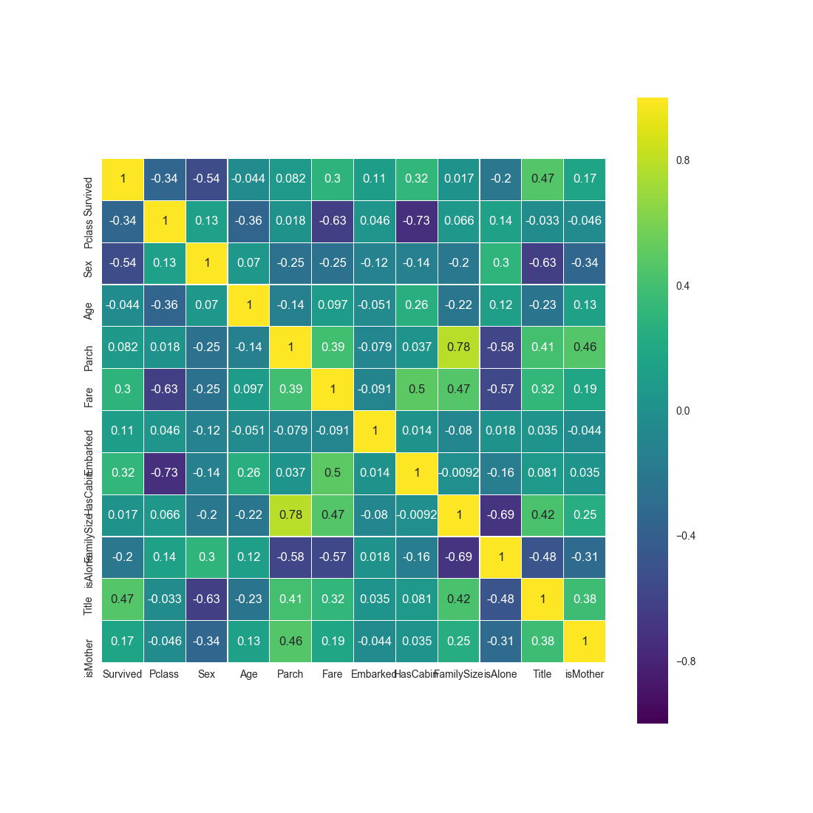
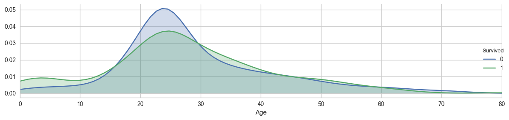
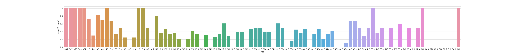
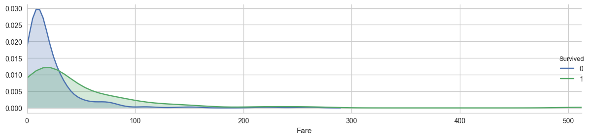
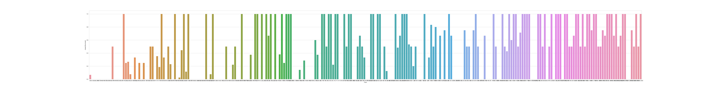
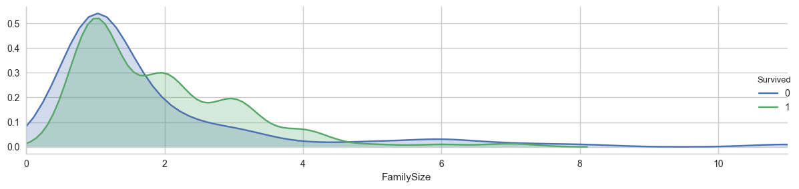
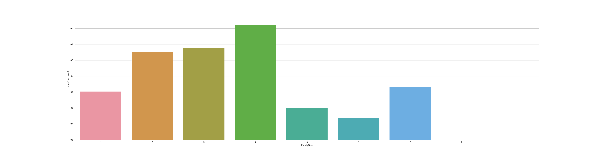

# Titanic Survival Prediction: Machine Learning Pipeline

Recently, I have become very interested in data science and machine learning. As I am still a novice to the field, I started off with predicting the survival of passengers on the Titanic and grasping the core concept of feature engineering.

## Background

When built, the Titanic was praised as being unsinkable and nicknamed "The Ship of Dreams" because of how grand and luxurious it was. So, when it collided with an iceburg and sunk, it shocked the world. It killed 1502 out of the 2224 passengers and crew aboard the ship. As we know, some groups of people were more likely to survive than others, those being women, children and the wealthy. This project will dive into the data provided to analyze the survival rates of those aboard. 


## Feature Engineering

As we know, the data you use to train your model will influence it and the results you achieve, which are determined by a combination of the data provided, the model choosen and the features prepared. Feature engineering is the process of manipulating your data to better represent the problem you are trying to solve. Basically, it's figuring out what the "input" is. It can be the most important part of the entire process, and also the most rewarding. In this project, we will look into transforming our raw data to characterize passengers who are mothers, children and the wealthy and see how other features affect our results.

Correalation of features how related they are to each other - how dependent (or independent!) they are. Generally, high correalated features in your input data *shouldn't* harm your results. For a fixed number of training examples, it may increase your accuracy by a small fraction, however, as the number of features increase it may lead to your data being undersampled and your accuracy decreasing. This is because is two features are highly related, they add very little information. 

This heatmap shows the correalation between features:



As we can see, Parch (Parents and Children) and FamilySize are highly correlated, Cabin and Fare are also somewhat correlated. And from our knowledge about these factors, we can confirm that it makes sense that they are dependent.

### Data + Graphs 

Here are some of the other visuals I created, god bless @seaborn 

**Age**

  

**Fare**



**Family Size** 



### Models

Choosing a machine learning model in order to analyze your data is also a crucial step in the process. We will look into 5 different models and see how their results differ depending on the data we feed, and also see which features each values the most. The 5 different kinds are:
```
	1. Logistic Regression: Describes the data by explaining the relationships between one dependant binary variable and one or more independent variables. 

	2. Support Vector Machine (SVC): https://www.analyticsvidhya.com/blog/2015/10/understaing-support-vector-machine-example-code/

	3. Random Forest Classifier: Uses a "so-called bagging approach" where we have a bias-variance tradeoff. 

	4. K Neighbours Classifier: Classifies a test sample based on the k closest neighbours to it and the majority of those types.

	5. Gaussian Naive Bayes: Based on Bayes' Theorum with an assumption on independence amoung predictors. So although passenger class, age and sex may be related in one's survival, this model considers them independant of each other. https://www.analyticsvidhya.com/blog/2015/09/naive-bayes-explained/
```

Based on my analysis, I found that Random Forest Classifier worked the best for the features I created with the given data, giving an accuracy of roughly 90.1% 

### Installing

will write steps later

```
will fill in later
```

## Deployment

Will fill this in later 

## Built With

* [Python](https://www.python.org/downloads/) - The language used
* [sklearn](http://scikit-learn.org/stable/) - Python data science library 
* Love 

## Authors

* **Rabeea Ahmad**

## License

This project is licensed under the MIT License - see the [LICENSE.md](LICENSE.md) file for details

## Acknowledgments

* Check out the Titanic dataset on Kaggle: https://www.kaggle.com/c/titanic